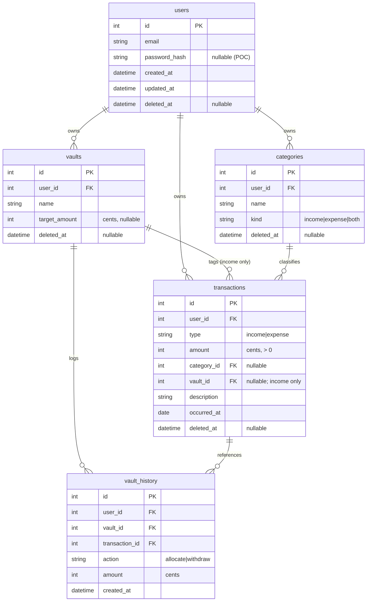
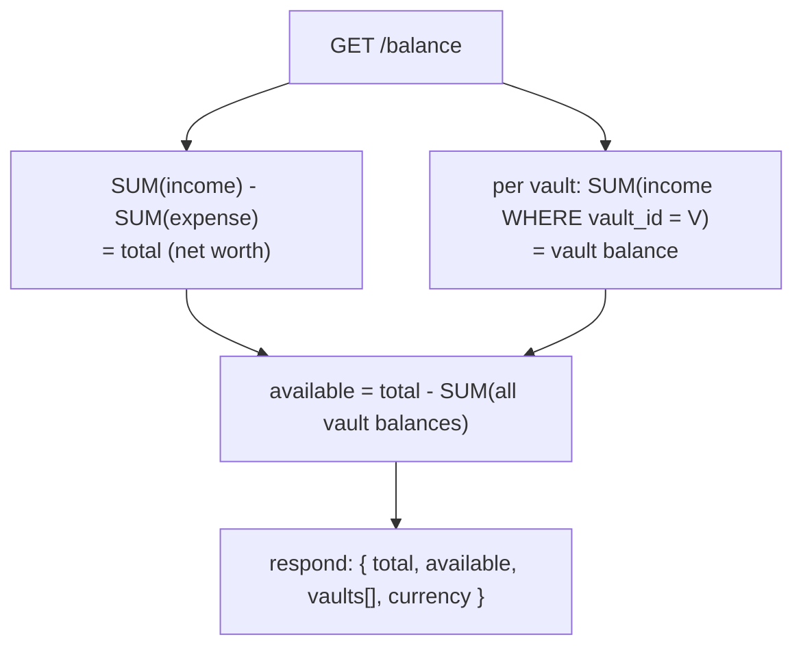
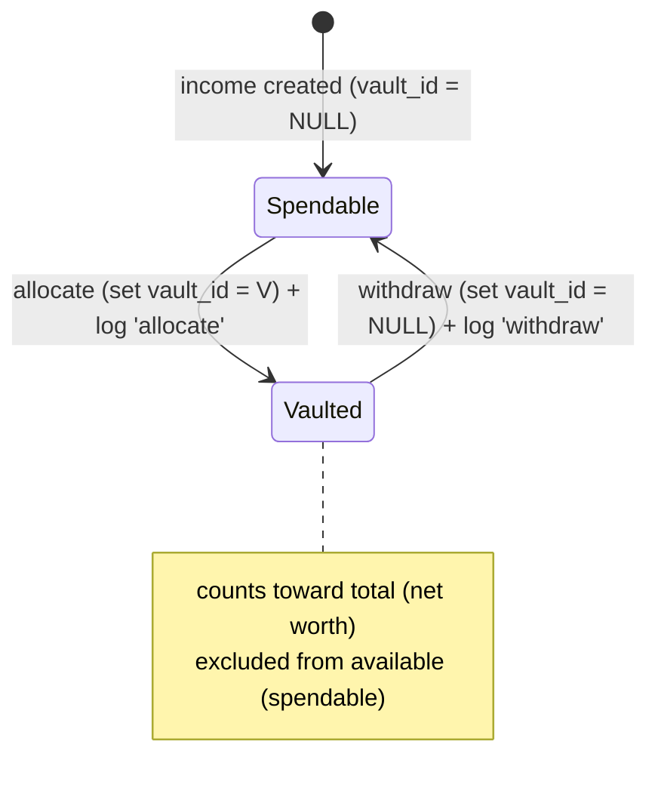
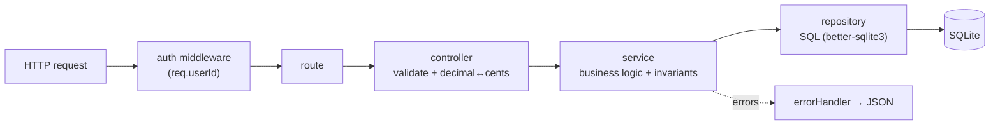

# ARCHITECTURE — `balance`

Agent- and human-readable map of the system: data model, balance logic, request flow, and where everything lives. Pair with `PRD.md` (requirements) and `CLAUDE.md` (commands/conventions).

## Data model (ER diagram)



**Notes**
- All amounts are integer **cents**. API converts to/from decimals at the boundary.
- All tables soft-delete via nullable `deleted_at` (`NULL` = active). Every read filters `deleted_at IS NULL`.
- `transactions.vault_id` is **mutable** and only valid when `type = 'income'`.

## Balance calculation flow



Allocate / withdraw lifecycle of a single income transaction:



## Request lifecycle (layered per module)



## Directory map

```
balance/
├── src/
│   ├── config/
│   │   ├── env.js          # load/validate .env.<NODE_ENV>; export config
│   │   └── db.js           # better-sqlite3 connection (path from config)
│   ├── db/
│   │   ├── schema.sql      # full DDL: tables, indexes, constraints
│   │   ├── migrate.js      # apply schema.sql
│   │   └── seed.js         # seed user_id=1 + default categories
│   ├── middleware/
│   │   ├── auth.js         # POC: inject req.userId = 1 (swap for real auth)
│   │   ├── errorHandler.js # central error → JSON + status
│   │   └── validate.js     # boundary validation helpers
│   ├── lib/
│   │   └── money.js        # decimal ↔ cents
│   ├── modules/
│   │   ├── transactions/   # route, controller, service, repository
│   │   ├── vaults/         # + allocate/withdraw actions, history
│   │   ├── categories/     # route, controller, service, repository
│   │   └── balance/        # aggregate queries
│   ├── app.js              # express wiring (routes + middleware)
│   └── server.js           # boot: config → migrate → seed → listen
├── .env.example            # committed template
├── .env.stage              # gitignored
├── .env.prod               # gitignored
├── data/                   # gitignored: balance.stage.db, balance.prod.db
├── .claude/agents/plans/   # feature plans (/plan-feature output)
├── PRD.md
├── CLAUDE.md
├── ARCHITECTURE.md
└── README.md
```

## Conventions recap

- **Layering:** controllers do HTTP + validation + money conversion; services hold logic/invariants; repositories own SQL. No SQL outside repositories.
- **Auth-ready:** all tables carry `user_id`; only the auth middleware changes in Phase 2.
- **Invariants:** positive amounts; `expense` ⇒ `vault_id = NULL`; `vault_id` references active vaults only.
