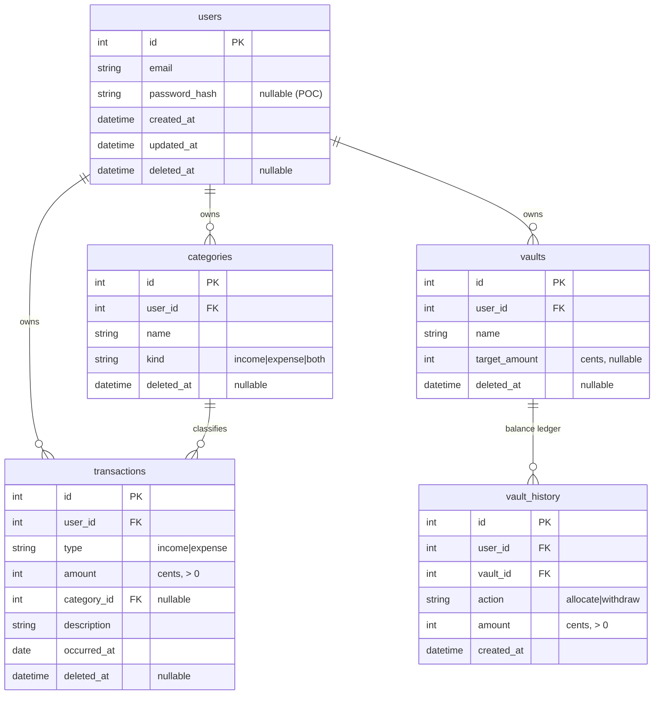
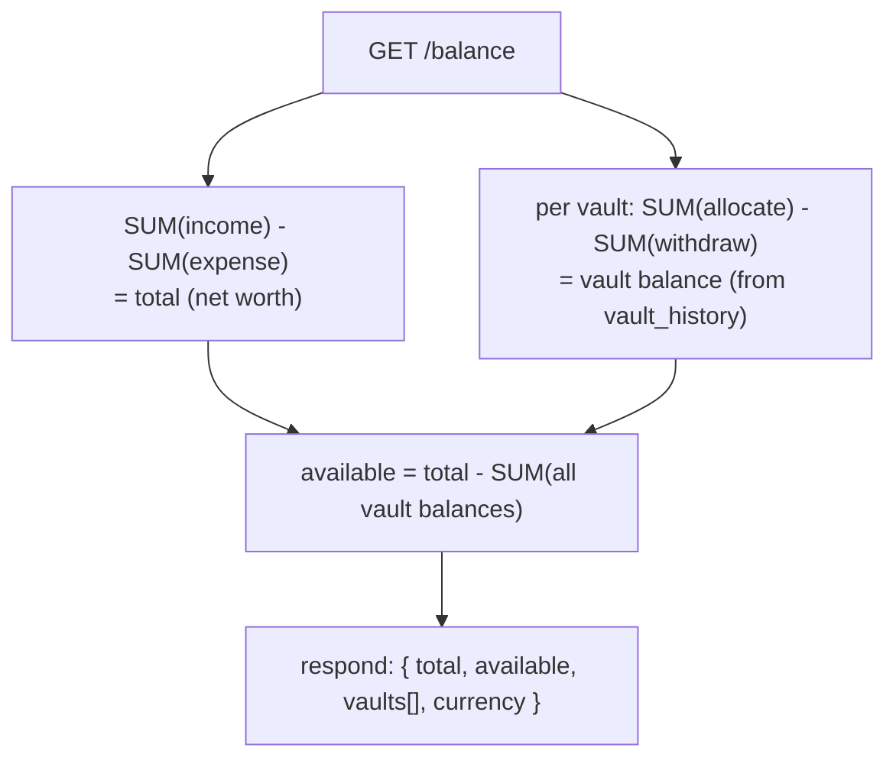
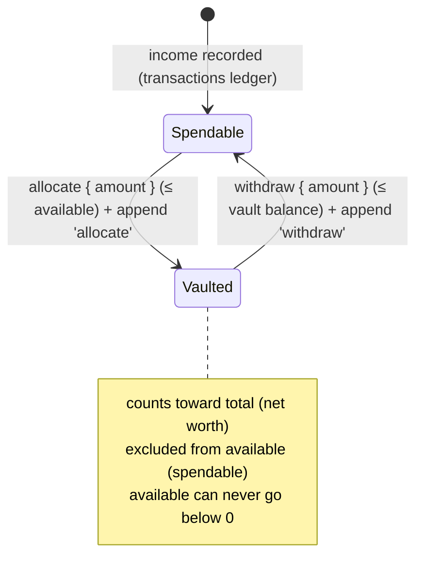
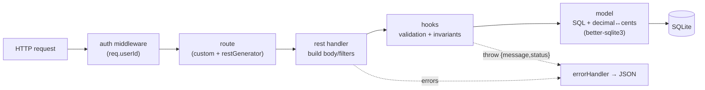

# ARCHITECTURE — `balance`

Agent- and human-readable map of the system: data model, balance logic, request flow, and where everything lives. Pair with `PRD.md` (requirements) and `CLAUDE.md` (commands/conventions).

## Data model (ER diagram)



**Notes**
- All amounts are integer **cents**. API converts to/from decimals at the boundary.
- All tables soft-delete via nullable `deleted_at` (`NULL` = active). Every read filters `deleted_at IS NULL`.
- `transactions` is a **pure ledger** — no vault reference. `vault_history` is the **append-only source of truth** for vault balances (`balance = Σallocate − Σwithdraw`). See ADR-004.

## Balance calculation flow



Allocate / withdraw move an **amount** between spendable and a vault (independent of any transaction):



## Request lifecycle (entity pattern)

Each entity is generated, not hand-written per layer. A `Router` mounts any custom
routes first, then `restGenerator` adds the standard CRUD handlers. Handlers fire
lifecycle **hooks** (validation + invariants) around the **model**, which owns the SQL
and the decimal↔cents conversion (via `modelGenerator`).



Generated CRUD lives in `src/utils/`: `modelGenerator` (findAll/findById/create/update/softDelete,
money conversion, user-scope + `deleted_at IS NULL`) and `restGenerator` (GET `/`, GET `/:id`,
POST `/`, PUT `/:id`, DELETE `/:id`). Hook constants: `BEFORE_CREATE`, `CREATE`, `BEFORE_UPDATE`,
`UPDATE`, `LIST_ALL`, `GET_ONE`, `BEFORE_DESTROY`, `DESTROY`.

## Directory map

```
balance/
├── src/
│   ├── config/
│   │   ├── env.js          # load/validate .env.<NODE_ENV>; export config
│   │   └── db.js           # better-sqlite3 connection (path from config)
│   ├── db/
│   │   ├── schema.sql      # full DDL: tables, indexes, constraints
│   │   ├── migrate.js      # apply schema.sql
│   │   └── seed.js         # seed user_id=1 + default categories
│   ├── constants/
│   │   └── hooks.js        # lifecycle hook type constants
│   ├── middleware/
│   │   ├── auth.js         # POC: inject req.userId = 1 (swap for real auth)
│   │   └── errorHandler.js # central error → JSON + status
│   ├── lib/
│   │   └── money.js        # decimal ↔ cents
│   ├── utils/
│   │   ├── modelGenerator/ # generic CRUD model (SQL + money conversion)
│   │   └── restGenerator/  # generic CRUD routes + handlers/ (fire hooks)
│   ├── entities/
│   │   ├── transactions/   # constants, db/{fields,model}, http/{hooks,routes}
│   │   ├── vaults/         # + http/controller (allocate/withdraw/history), db/history
│   │   ├── categories/     # constants, db/{fields,model}, http/{hooks,routes}
│   │   ├── balance/        # db/queries (aggregate), http/routes
│   │   └── index.js        # collects all entities
│   ├── app.js              # express wiring (mounts entity routes + middleware)
│   └── server.js           # boot: config → migrate → seed → listen
├── .env.example            # committed template
├── .env.stage              # gitignored
├── .env.prod               # gitignored
├── data/                   # gitignored: balance.stage.db, balance.prod.db
├── .claude/agents/plans/   # feature plans (/plan-feature output)
├── PRD.md
├── CLAUDE.md
├── ARCHITECTURE.md
└── README.md
```

## Conventions recap

- **Entity pattern:** each resource is a generated model + routes under `src/entities/<name>/`. Custom routes register **before** `restGenerator` so they aren't shadowed by `/:id`.
- **Validation & invariants** live in `http/hooks.js` (throw `{ message, status }` to short-circuit) — not in routes or handlers. No SQL outside `db/model.js` (or `db/queries.js` for balance).
- **Cross-entity access:** import the model file directly (e.g. `../../transactions/db/model`), never via the entity `index.js`, to avoid circular deps.
- **Money:** stored as integer cents; the model layer (`modelGenerator` `moneyFields`) converts decimal↔cents at the read/write boundary.
- **Auth-ready:** all tables carry `user_id`; only the auth middleware changes in Phase 2.
- **Balances are derived** from the two ledgers (`transactions`, `vault_history`) — never stored. Cent-level helpers live in `balance/db/queries.js` and are reused by transaction hooks (the `available ≥ 0` guard) and the vaults controller.
- **Invariants:** positive amounts; `available ≥ 0` on every spendable-affecting write; withdraw ≤ vault balance; a vault deletes only at balance 0. See ADR-004.
